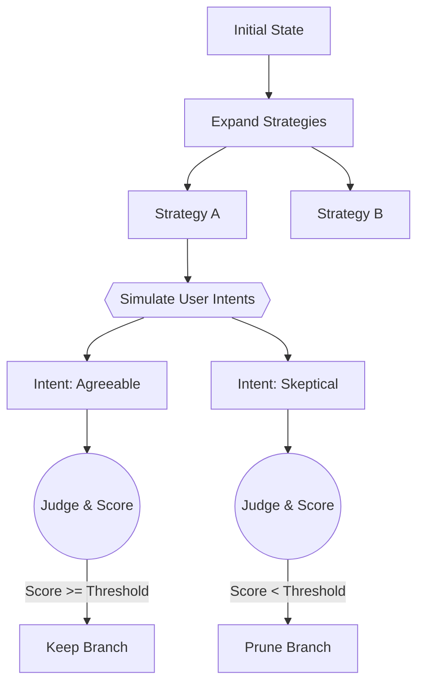

# Dialogue Tree Search (DTS)

[](https://www.python.org/downloads/)
[](https://opensource.org/licenses/Apache-2.0)
[](https://github.com/astral-sh/ruff)
[](https://github.com/astral-sh/uv)

An LLM-powered search engine that applies MCTS principles to multi-turn conversation optimization. Given a goal, DTS expands candidate strategies, simulates user reactions across multiple intent profiles, scores trajectories via multi-judge consensus, and prunes underperformers.

---

## Table of Contents

- [How It Works](#how-it-works)
- [Key Features](#key-features)
- [Installation](#installation)
- [Quick Start](#quick-start)
- [Configuration](#configuration)
- [Architecture](#architecture)
- [Token Usage & Costs](#token-usage--costs)
- [License](#license)

---

## How It Works

DTS frames conversation as a tree search problem. Rather than generating one response at a time, it expands multiple strategies in parallel, forks each by simulated user intents, and evaluates resulting trajectories against the stated goal.



---

## Key Features

- **Beam search with intent forking** — branches split across simulated user personas (emotional tone, skepticism level, domain knowledge)
- **Multi-judge scoring** — 3 LLM judges evaluate each trajectory; median vote reduces variance
- **Threshold-based pruning** — configurable cutoffs discard low-scoring branches early
- **Token accounting** — per-run breakdowns of usage by component
- **Provider-agnostic** — any OpenAI-compatible API (OpenRouter, OpenAI, local endpoints)

---

## Installation

Requires Python 3.11+

```bash
git clone https://github.com/MVPandey/DTS.git
cd DTS

# Install uv if needed
curl -LsSf https://astral.sh/uv/install.sh | sh

# Set up environment
uv venv .venv
source .venv/bin/activate  # Windows: .venv\Scripts\activate
uv pip install -e .
```

Create `.env`:

```env
# Required
LLM_API_KEY=sk-or-v1-...

# Optional (defaults shown)
LLM_BASE_URL=https://openrouter.ai/api/v1
LLM_NAME=minimax/minimax-m2.1
```

---

## Quick Start

```python
import asyncio
from backend.core.dts import DTSConfig, DTSEngine
from backend.llm.client import LLM

async def main():
    llm = LLM(
        api_key="sk-...",
        base_url="https://openrouter.ai/api/v1",
        model="z.ai/glm-4.7"
    )

    config = DTSConfig(
        goal="Negotiate a 10% discount on cloud services",
        first_message="Hello, I'd like to discuss our current contract.",
        init_branches=4,
        turns_per_branch=3,
        scoring_mode="comparative"
    )

    engine = DTSEngine(llm=llm, config=config)
    result = await engine.run(rounds=2)

    print(f"Best Score: {result.best_score}")
    result.save_json("output.json")

if __name__ == "__main__":
    asyncio.run(main())
```

Or run the example directly:

```bash
python main.py
```

---

## Configuration

`DTSConfig` controls tree shape and search behavior:

| Parameter | Type | Default | Description |
|:----------|:-----|:--------|:------------|
| `goal` | `str` | *required* | Conversation objective |
| `first_message` | `str` | *required* | Opening user message |
| `init_branches` | `int` | `6` | Initial strategy count |
| `turns_per_branch` | `int` | `5` | Simulation depth per branch |
| `user_intents_per_branch` | `int` | `3` | User personas per strategy |
| `scoring_mode` | `str` | `"comparative"` | `"absolute"` (0-10) or `"comparative"` (rank) |
| `prune_threshold` | `float` | `6.5` | Minimum score to survive |
| `keep_top_k` | `int \| None` | `None` | Hard cap on survivors |
| `min_survivors` | `int` | `1` | Floor on surviving branches |
| `max_concurrency` | `int` | `16` | Parallel LLM call limit |
| `temperature` | `float` | `0.7` | Generation temperature |
| `judge_temperature` | `float` | `0.3` | Evaluation temperature |

---

## Architecture

Four components handle the expand → score → prune loop:

| Component | Location | Role |
|:----------|:---------|:-----|
| **DTSEngine** | `backend/core/dts/engine.py` | Orchestrates search rounds |
| **StrategyGenerator** | `backend/core/dts/components/generator.py` | Produces strategies and user intents |
| **ConversationSimulator** | `backend/core/dts/components/simulator.py` | Runs multi-turn rollouts with intent forking |
| **TrajectoryEvaluator** | `backend/core/dts/components/evaluator.py` | Multi-judge trajectory scoring |

Supporting modules:
- `backend/core/dts/tree.py` — Tree data structure
- `backend/core/dts/types.py` — Data models (DialogueNode, Strategy, UserIntent, etc.)
- `backend/llm/client.py` — OpenAI-compatible client wrapper

---

## Token Usage & Costs

Parallel simulation means higher token consumption than single-path chat. The engine tracks usage by component:

```json
{
  "total_tokens": 15420,
  "breakdown": {
    "strategy_generation": "15%",
    "user_simulation": "35%",
    "assistant_simulation": "25%",
    "evaluation": "25%"
  }
}
```

To reduce costs during iteration:
- Raise `prune_threshold` aggressively
- Set `keep_top_k` to bound branch count
- Lower `turns_per_branch` for faster feedback
- Set `user_intents_per_branch=1` to disable forking

---

## License

Apache License 2.0 — see [LICENSE](LICENSE).