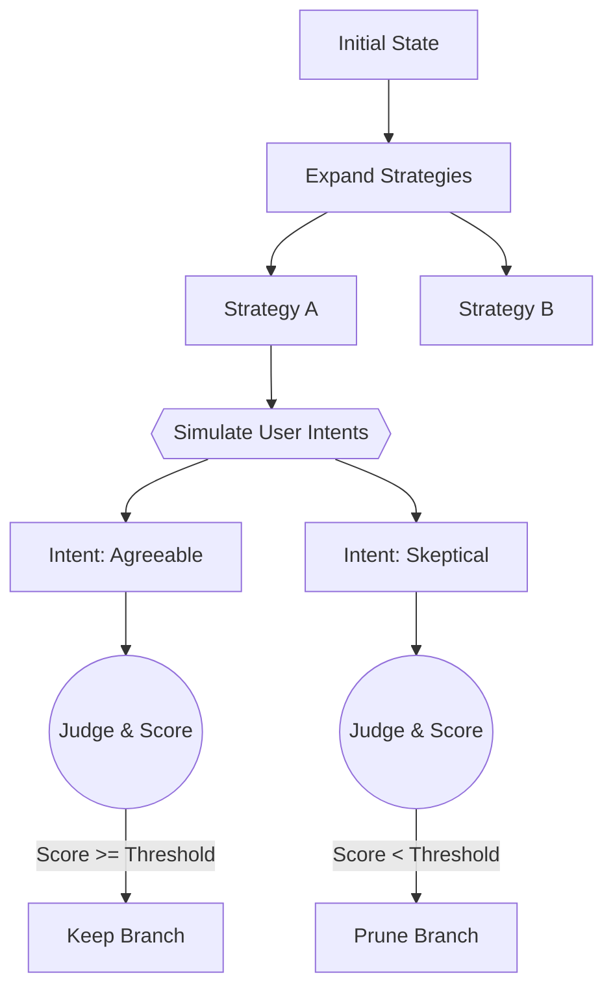

# Dialogue Tree Search (DTS)

[](https://www.python.org/downloads/)
[](https://opensource.org/licenses/Apache-2.0)
[](https://github.com/astral-sh/ruff)
[](https://github.com/astral-sh/uv)

**Dialogue Tree Search** is an LLM-powered engine that discovers optimal conversation strategies by exploring multiple future possibilities in parallel.

Unlike standard chatbots that respond linearly, DTS uses **Monte Carlo Tree Search (MCTS)** principles to simulate conversation branches, fork based on predicted user intents, and prune suboptimal trajectories using multi-judge consensus.

---

## Table of Contents

- [How It Works](#-how-it-works)
- [Key Features](#-key-features)
- [Installation](#-installation)
- [Quick Start](#-quick-start)
- [Configuration](#-configuration)
- [Architecture](#-architecture)
- [Token Usage & Costs](#-token-usage--costs)
- [Contributing](#-contributing)
- [License](#license)

---

## 🧠 How It Works

DTS treats conversation as a search problem. It doesn't just generate the "next best token"—it generates the "next best strategy" and simulates how different users might react to it.



---

## ✨ Key Features

- **Beam Search with Intent Forking**: Explores conversation paths by simulating diverse user behaviors (emotional tones, cognitive stances)
- **Multi-Judge Consensus**: Trajectories are evaluated by a panel of 3 AI judges using median voting to reduce variance
- **Intelligent Pruning**: Automatically discards dead-end conversations based on configurable thresholds
- **Cost Transparency**: Tracks detailed token usage and cost breakdowns per search run
- **LLM Agnostic**: Built on the OpenAI SDK, compatible with OpenRouter, OpenAI, or any OpenAI-compatible provider

---

## 🚀 Installation

**Prerequisites**: Python 3.11+

```bash
git clone https://github.com/MVPandey/DTS.git
cd DTS

# Install uv (if not already installed)
curl -LsSf https://astral.sh/uv/install.sh | sh

# Create virtual environment and install dependencies
uv venv .venv
source .venv/bin/activate  # Windows: .venv\Scripts\activate
uv pip install -e .
```

Create a `.env` file with your configuration:

```env
# Required
LLM_API_KEY=sk-or-v1-...

# Optional (with defaults shown)
LLM_BASE_URL=https://openrouter.ai/api/v1
LLM_NAME=minimax/minimax-m2.1
```

---

## ⚡ Quick Start

```python
import asyncio
from backend.core.dts import DTSConfig, DTSEngine
from backend.llm.client import LLM

async def find_optimal_strategy():
    # Initialize LLM client
    llm = LLM(
        api_key="sk-...",
        base_url="https://openrouter.ai/api/v1",
        model="z.ai/glm-4.7"
    )

    # Configure the search
    config = DTSConfig(
        goal="Negotiate a 10% discount on cloud services",
        first_message="Hello, I'd like to discuss our current contract.",
        init_branches=4,
        turns_per_branch=3,
        scoring_mode="comparative"
    )

    # Run the search
    engine = DTSEngine(llm=llm, config=config)
    result = await engine.run(rounds=2)

    print(f"Best Score: {result.best_score}")
    result.save_json("output.json")

if __name__ == "__main__":
    asyncio.run(find_optimal_strategy())
```

Or simply run the included example:

```bash
python main.py
```

---

## ⚙️ Configuration

The `DTSConfig` dataclass controls the shape of the search tree:

| Parameter | Type | Default | Description |
|:----------|:-----|:--------|:------------|
| `goal` | `str` | *required* | The conversation objective (e.g., "Close the sale") |
| `first_message` | `str` | *required* | Initial user message to start the conversation |
| `init_branches` | `int` | `6` | Number of distinct strategies to generate initially |
| `turns_per_branch` | `int` | `5` | Depth of conversation simulation per branch |
| `user_intents_per_branch` | `int` | `3` | Number of user personas to simulate per strategy |
| `scoring_mode` | `str` | `"comparative"` | `"absolute"` (0-10 scale) or `"comparative"` (rank-based) |
| `prune_threshold` | `float` | `6.5` | Minimum score required to survive pruning |
| `keep_top_k` | `int \| None` | `None` | Cap survivors to top K branches |
| `min_survivors` | `int` | `1` | Minimum branches to keep even if below threshold |
| `max_concurrency` | `int` | `16` | Maximum parallel LLM calls |
| `temperature` | `float` | `0.7` | Temperature for conversation generation |
| `judge_temperature` | `float` | `0.3` | Temperature for judge evaluations |

---

## 🏗️ Architecture

DTS is composed of four modular components:

| Component | File | Purpose |
|:----------|:-----|:--------|
| **DTSEngine** | `backend/core/dts/engine.py` | Main orchestrator managing the expand → score → prune loop |
| **StrategyGenerator** | `backend/core/dts/components/generator.py` | Generates diverse conversation strategies and user intents |
| **ConversationSimulator** | `backend/core/dts/components/simulator.py` | Simulates multi-turn conversations with intent forking |
| **TrajectoryEvaluator** | `backend/core/dts/components/evaluator.py` | Scores trajectories using multi-judge consensus |

Supporting modules:
- `backend/core/dts/tree.py` - Dialogue tree data structure
- `backend/core/dts/types.py` - Data models (DialogueNode, Strategy, UserIntent, etc.)
- `backend/llm/client.py` - OpenAI-compatible LLM client

---

## 💰 Token Usage & Costs

DTS simulates parallel futures, so token usage is higher than a standard chat. The engine provides detailed cost tracking:

```json
{
  "total_tokens": 15420,
  "breakdown": {
    "strategy_generation": "15%",
    "user_simulation": "35%",
    "assistant_simulation": "25%",
    "evaluation": "25%"
  }
}
```

**Cost optimization tips:**
- Use aggressive `prune_threshold` during development
- Set `keep_top_k` to limit branch explosion
- Reduce `turns_per_branch` for faster iteration
- Use `user_intents_per_branch=1` to disable intent forking

---

## License

This project is licensed under the Apache License 2.0 - see the [LICENSE](LICENSE) file for details.
